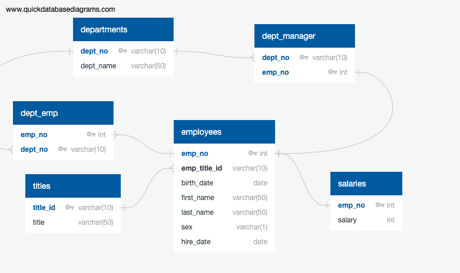

## SQL Challenge

### Background

This project involves six CSV files containing human resources data from a fictional company. The objective is to create database tables to store the CSV data, import the files into an SQL database, and analyze the data to generate valuable insights for the company's management team. The original CSV files can be found in the 'data' folder.

This challenge clearly demonstrates my skill in building SQL databases from various sources and extracting relevant insights through queries of different complexities.

### Instructions

This Challenge was divided into three parts:

1. Data Modelling
2. Data Engineering
3. Data Analysis

#### _1. Data Modelling_

- Inspect the CSV files, and then sketch an ERD of the tables.

To create the sketch below, I used the tool provided by [Quick DBD](https://www.quickdatabasediagrams.com).

#### _2. Data Engineering_

- Use the provided information to create a table schema for each of the six CSV files.
- Import each CSV file into its corresponding SQL table.

The file `tablesschema.mssql` contains the schema, specifying the data types, primary keys, foreign keys, and other constraints.

#### _3. Data Analysis_

- Perform queries to respond to the following items using the database created:

1. List the employee number, last name, first name, sex, and salary of each employee.
2. List the first name, last name, and hire date for the employees who were hired in 1986.
3. List the manager of each department along with their department number, department name, employee number, last name, and first name.
4. List the department number for each employee along with that employee’s employee number, last name, first name, and department name.
5. List the first name, last name, and sex of each employee whose first name is Hercules and whose last name begins with the letter B.
6. List each employee in the Sales department, including their employee number, last name, and first name.
7. List each employee in the Sales and Development departments, including their employee number, last name, first name, and department name.
8. List the frequency counts, in descending order, of all the employee last names (that is, how many employees share each last name).

The file `queries.mssql` contains the queries used to respond to the items above.
